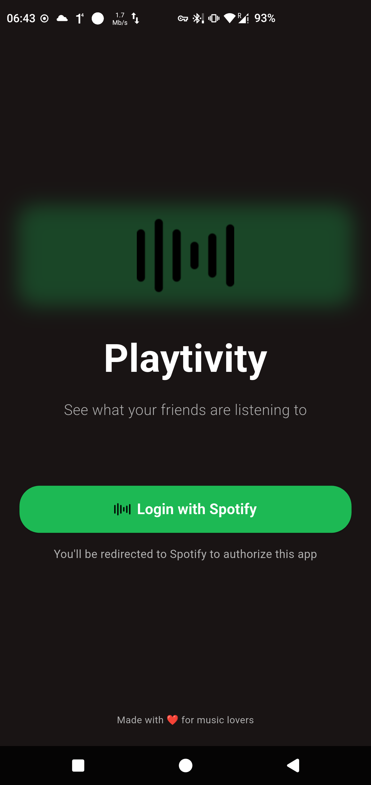
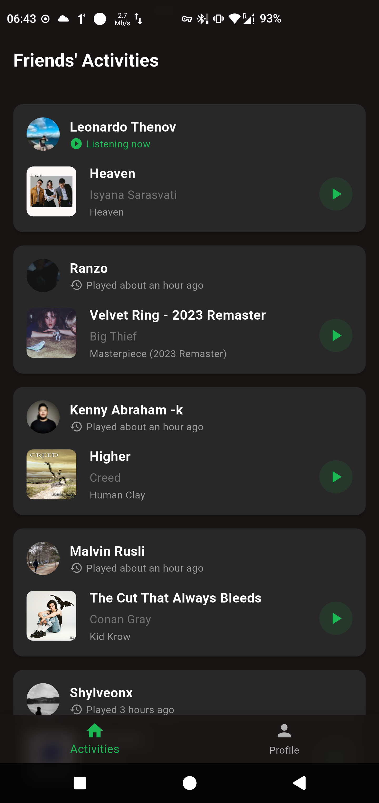
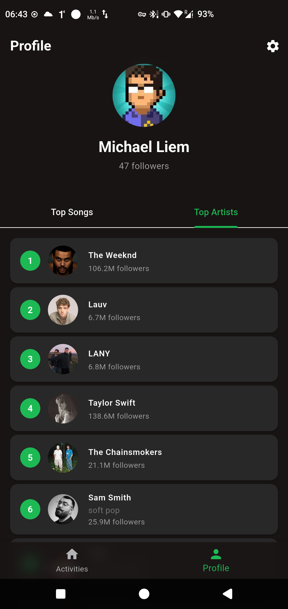
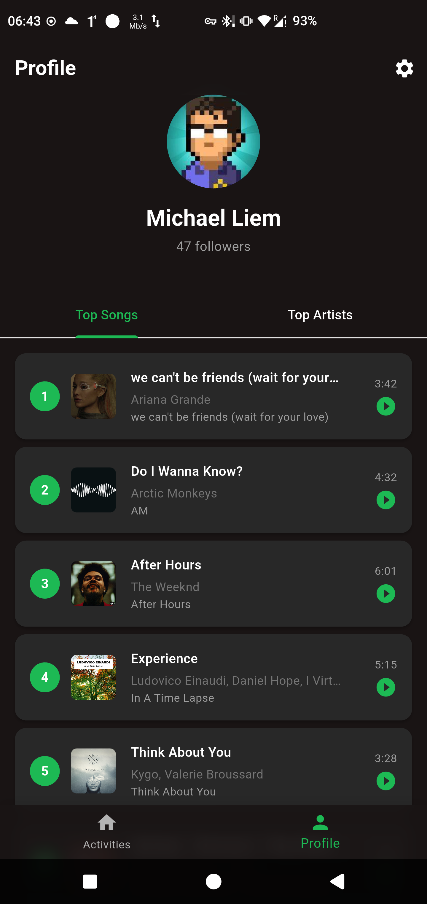
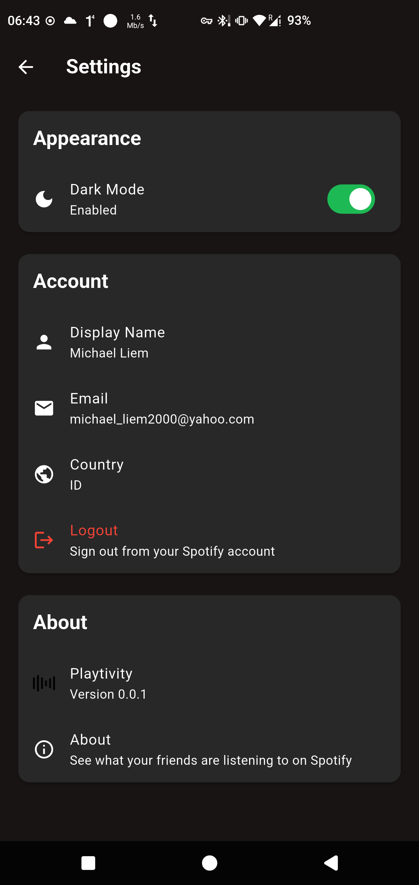

<div align="center">
  
  
  # Playtivity - Spotify Friends Activity App
  
  A Flutter app that shows your friends' Spotify activities in real-time. Built with Flutter and the Spotify Web API.
  
  
  
  
</div>

## Features

- **🔐 Secure Login**: OAuth authentication through embedded WebView
- **🎵 Real Friend Activities**: Automatically extracts `sp_dc` cookie during login for friend activity access
- **📱 Profile Dashboard**: View currently playing, top tracks, and top artists
- **🌙 Dark Mode**: Toggle between light and dark themes
- **🎨 Spotify Design**: Authentic Spotify branding and colors

## Screenshots

<div align="center">
  <table>
    <tr>
      <td align="center">
        
        <br><em>Login Screen</em>
      </td>
      <td align="center">
        
        <br><em>Home Screen</em>
      </td>
    </tr>
    <tr>
      <td align="center">
        
        <br><em>Profile - Top Artists</em>
      </td>
      <td align="center">
        
        <br><em>Profile - Top Songs</em>
      </td>
    </tr>
    <tr>
      <td align="center">
        
        <br><em>Settings Screen</em>
      </td>
    </tr>
  </table>
</div>

## How It Works

### Friend Activities
The app uses an innovative approach to show friend activities without requiring your own Spotify API credentials:

1. **Direct Web Authentication**: Uses Spotify's web login flow directly without requiring API registration
2. **Automatic Cookie Extraction**: During the login process, the app automatically extracts the `sp_dc` cookie from the WebView
3. **Internal API Access**: Uses the extracted cookie to generate access tokens for Spotify's internal buddy list API
4. **Real-time Data**: Accesses the same endpoints used by Spotify's web player for friend activities

### Technical Implementation
- **TOTP Generation**: Implements the same TOTP algorithm used by Spotify's internal systems
- **Token Generation**: Automatically generates access tokens using the `sp_dc` cookie and TOTP
- **API Integration**: Calls the same endpoints used by Spotify's web player for friend activities

## Setup

1. **Clone the repository**:
   ```bash
   git clone <repository-url>
   cd playtivity
   ```

2. **Set up Spotify Developer App** 

   To enable full functionality, you need to create a Spotify Developer app and configure your credentials. Follow these steps:
   without it, features like getting album photos and profile data will not work.
   ### Create Spotify Developer Account
   1. Go to [Spotify Developer Dashboard](https://developer.spotify.com/dashboard)
   2. Log in with your Spotify account (or create one)
   3. Accept the Spotify Developer Terms of Service

   ### Create New App
   1. Click **"Create App"** button
   2. Fill in the app details:
      - **App Name**: `Playtivity` (or your preferred name)
      - **App Description**: `Flutter app that shows friends' Spotify activities in real-time`
      - **Website**: Your website URL (optional)
      - **Redirect URI**: `https://yourdomain.com` or `playtivity://callback` for mobile
      - **API/SDKs**: Check "Web API"

   ### Configure Environment
   1. Copy `.env.example` to `.env`:
      ```bash
      copy .env.example .env
      ```
   2. Update `.env` with your app credentials:
      ```properties
      SPOTIFY_CLIENT_ID=your_client_id_from_dashboard
      SPOTIFY_CLIENT_SECRET=your_client_secret_from_dashboard
      SPOTIFY_REDIRECT_URI=https://yourdomain.com
      ```
   3. In your Spotify Developer Dashboard, add the same redirect URI to your app settings

3. **Install dependencies**:
   ```bash
   flutter pub get
   ```

4. **Run the app**:
   ```bash
   flutter run
   ```

## 🛠️ Development Scripts

The `scripts/` folder contains utility scripts for development:

### Icon & Image Generator
Automatically generates all required app icons and images from a single source image:

```bash
# Install Python dependencies
cd scripts
pip install -r requirements.txt

# Generate icons from your image (run from project root)
python scripts/convert_icon.py your_logo.svg
python scripts/convert_icon.py your_logo.png
```

**What it creates:**
- 📱 **Android Icons**: All mipmap densities (mdpi, hdpi, xhdpi, xxhdpi, xxxhdpi)
- 🖼️ **Flutter Images**: Login screen logos, button icons, display images
- 🎨 **Multiple Sizes**: 24x24 to 200x200 pixels for different use cases

See `scripts/README.md` for detailed usage instructions.

## Dependencies

- `provider` - State management
- `http` - API requests  
- `shared_preferences` - Local storage
- `webview_flutter` - Embedded OAuth login
- `cached_network_image` - Image caching
- `timeago` - Time formatting
- `font_awesome_flutter` - Spotify icons
- `crypto` - HMAC-SHA1 for TOTP generation

## Architecture

- **Providers**: State management for authentication and Spotify data
- **Services**: API integration for Spotify Web API and buddy list
- **Models**: Data structures for User, Track, and Activity
- **Screens**: Login, Home (activities), Profile, and Settings
- **Widgets**: Reusable components for activities and tracks

## Current Status

✅ OAuth authentication with automatic cookie extraction  
✅ Real friend activities via unofficial API  
✅ Profile data (currently playing, top tracks/artists)  
✅ Dark mode toggle

## 🧪 Testing Status

- **Android**: ✅ Fully tested on Android 15
- **iOS**: ❌ Not tested - community contributions welcome!

> **Note**: This app has only been tested on Android 15. While it's built with Flutter and should theoretically work on iOS, no testing has been performed on iOS devices. iOS users may encounter platform-specific issues. We welcome iOS testers and contributors!

## 🗺️ Roadmap

Future improvements planned:

- [ ] **Complete API-free implementation** - Remove all dependencies on Spotify API client/secret
- [ ] **iOS testing and support** - Test and fix iOS-specific issues
- [ ] **Home screen widgets** - Android widgets showing friend activity and currently playing

**Want to contribute?** Check out our [Contributing Guidelines](#-contributing) below!  

## 🤝 Contributing

We welcome contributions from the community! Here's how you can help:

### 🐛 Bug Reports
- **Found a bug?** Please [open an issue](../../issues) with:
  - Clear description of the problem
  - Steps to reproduce
  - Expected vs actual behavior
  - Screenshots if applicable
  - Device/OS information

### 🚀 Pull Requests
- **Pull requests are welcome!** Please:
  - Fork the repository
  - Create a feature branch (`git checkout -b feature/amazing-feature`)
  - Make your changes
  - Test thoroughly
  - Commit with clear messages
  - Push to your branch
  - Open a pull request with detailed description

### 🍴 Forks
- **Forks are encouraged!** Feel free to:
  - Fork this project for your own use
  - Customize it for your needs
  - Share your improvements back with the community
  - Create your own variations

### 💡 Feature Requests
- Have an idea? [Open an issue](../../issues) with the `enhancement` label
- Describe your use case and proposed solution

## 📄 License

This project is licensed under the **MIT License** - see the [LICENSE](LICENSE) file for details.

**TL;DR**: You can do whatever you want with this code - use it, modify it, distribute it, even commercially. Just keep the copyright notice.

### Third-Party Notices
- Spotify is a trademark of Spotify AB
- This project is not affiliated with or endorsed by Spotify
- Built for educational and personal use

---

Made with ❤️ for music lovers
