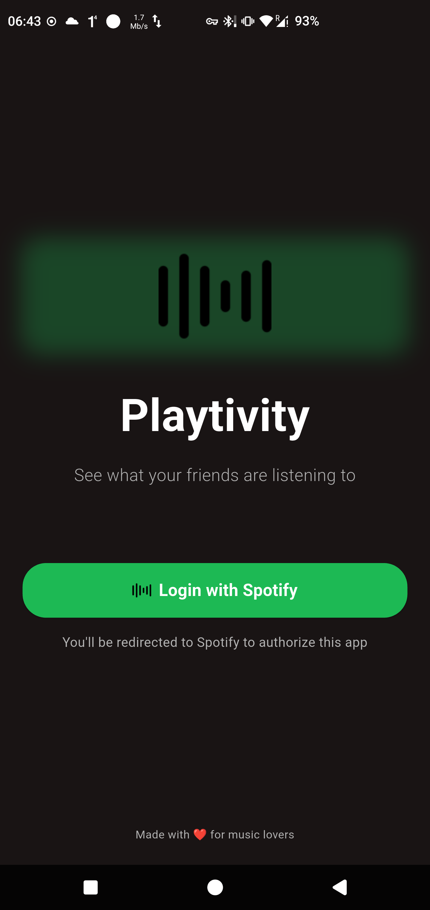
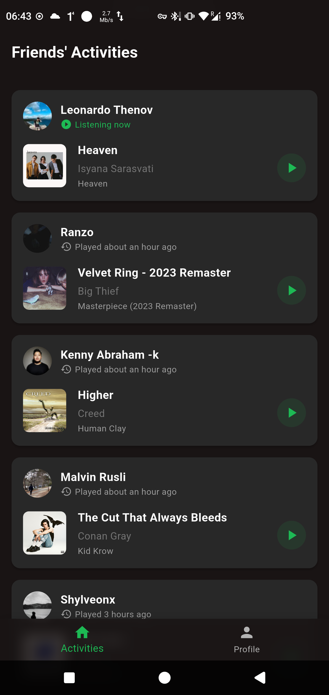
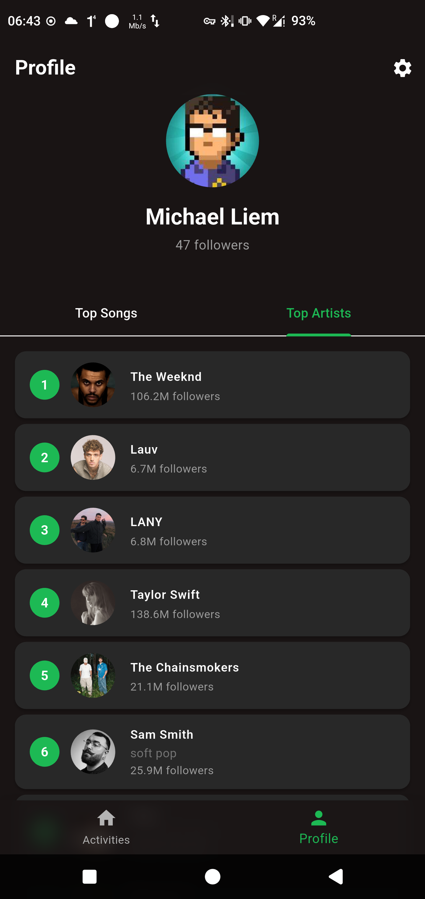
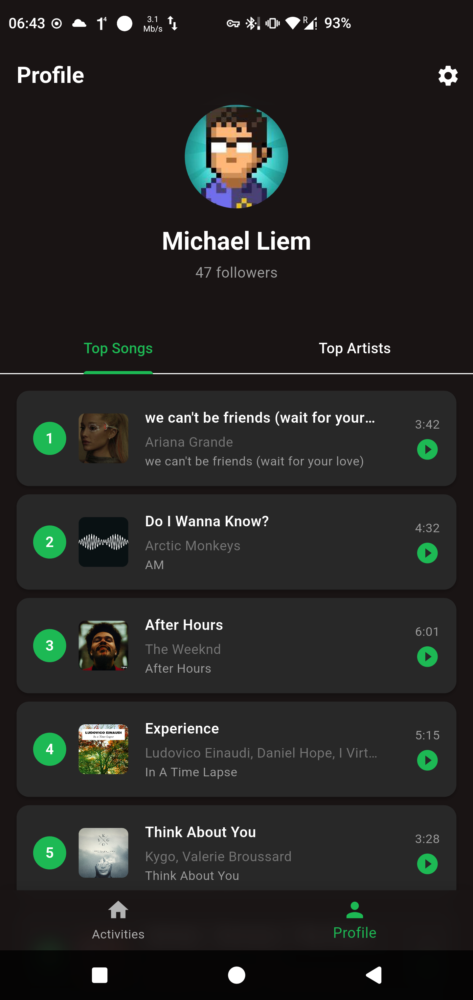
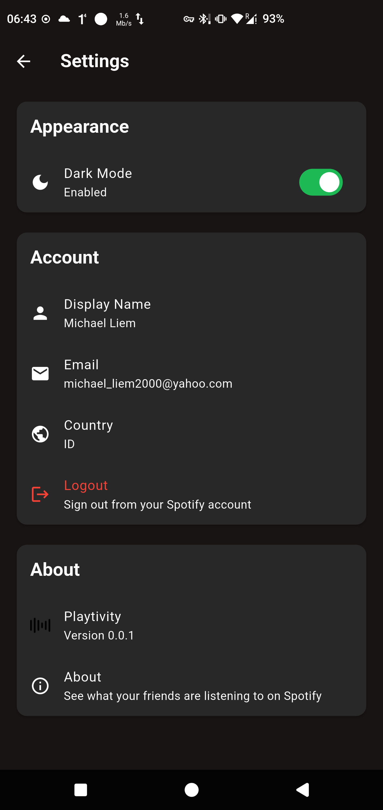

<div align="center">
  

  # Playtivity - Spotify Friends Activity App

  A Flutter app that shows your friends' Spotify activities in real-time.

  
  
  

  **[playtivity.mliem.com](https://playtivity.mliem.com)**
</div>

## Features

- **Secure Login**: OAuth authentication through embedded WebView
- **Real Friend Activities**: Shows what your friends are currently listening to
- **Profile Dashboard**: Currently playing, top tracks, and top artists
- **Home Screen Widget**: Android widget showing friend activity
- **Spotify Design**: Authentic Spotify dark theme and colors

## Screenshots

<div align="center">
  <table>
    <tr>
      <td align="center">
        
        <br><em>Login Screen</em>
      </td>
      <td align="center">
        
        <br><em>Home Screen</em>
      </td>
    </tr>
    <tr>
      <td align="center">
        
        <br><em>Profile - Top Artists</em>
      </td>
      <td align="center">
        
        <br><em>Profile - Top Songs</em>
      </td>
    </tr>
    <tr>
      <td align="center">
        
        <br><em>Settings Screen</em>
      </td>
    </tr>
  </table>
</div>

## How It Works

The app uses Spotify's web login flow to extract the `sp_dc` cookie, which is used to generate access tokens for Spotify's internal friend activity API — the same one used by the Spotify web player.

> **Note**: This app relies on Spotify's unofficial internal API, tested as of June 2026. Spotify may change or deprecate these endpoints at any time without notice, which could break functionality. There is no guarantee of long-term compatibility.

## Setup

```bash
git clone <repository-url>
cd playtivity
flutter pub get
flutter run
```

## Platform Support

**Android**: Fully tested on Android 15.

**iOS**: Not yet supported. iOS support is planned for a future release. Contributions welcome.

## Roadmap

- [x] API-free implementation
- [x] Home screen widgets
- [ ] iOS support

## Contributing

Bug reports, pull requests, and forks are welcome. [Open an issue](../../issues) to report bugs or suggest features.

## License

MIT — see [LICENSE](LICENSE) for details. Not affiliated with or endorsed by Spotify.

---

Made with ❤️ for music lovers
